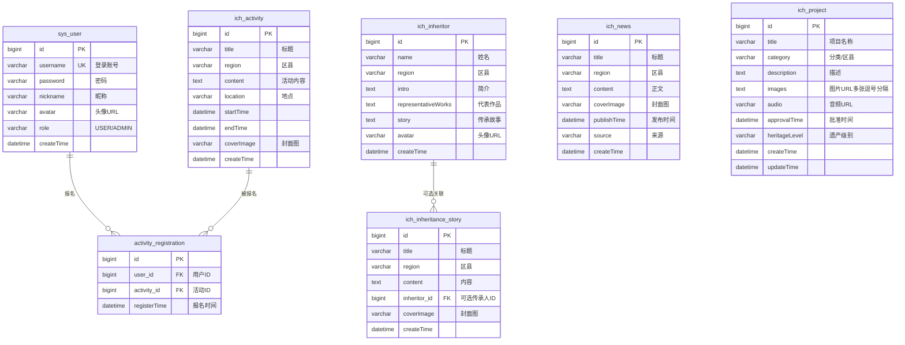

# 丽水非遗项目 — 数据库 ER 图

本文档描述本项目的实体与关系，对应 Spring Boot JPA 实体与表结构。

---

## 1. 实体一览

| 实体 | 表名 | 说明 |
|------|------|------|
| User | sys_user | 用户（含管理员），账号、昵称、头像、角色 |
| Activity | ich_activity | 非遗活动，标题、区县、时间地点、封面 |
| ActivityRegistration | activity_registration | 活动报名记录（用户↔活动） |
| News | ich_news | 非遗资讯，标题、区县、正文、封面、来源 |
| Inheritor | ich_inheritor | 非遗传承人，姓名、区县、简介、代表作品、故事、头像 |
| IchProject | ich_project | 非遗项目，名称、分类、描述、图片/音频、遗产级别 |
| InheritanceStory | ich_inheritance_story | 传承故事，标题、区县、内容，可关联传承人 |

---

## 2. 关系说明

- **User — Activity**：多对多，通过 **ActivityRegistration** 关联（用户报名活动）。
- **Inheritor — InheritanceStory**：一对多（可选），一条传承故事可关联一位传承人（`inheritor_id`）。
- 其余实体（News、IchProject、Activity、Inheritor）为独立业务表，无外键关联。

---

## 3. Mermaid ER 图

---

## 4. 表结构简表（字段清单）

### sys_user（用户）
- id, username, password, nickname, avatar, role, create_time

### ich_activity（活动）
- id, title, region, content, location, start_time, end_time, cover_image, create_time

### activity_registration（活动报名）
- id, user_id, activity_id, register_time（唯一约束：user_id + activity_id）

### ich_news（资讯）
- id, title, region, content, cover_image, publish_time, source, create_time

### ich_inheritor（传承人）
- id, name, region, intro, representative_works, story, avatar, create_time

### ich_project（非遗项目）
- id, title, category, description, images, audio, approval_time, heritage_level, create_time, update_time

### ich_inheritance_story（传承故事）
- id, title, region, content, inheritor_id, cover_image, create_time

---

*根据 `src/main/java/com/example/demo/entity/` 下实体类整理。*
