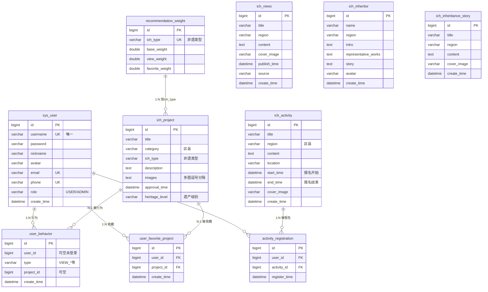

# 项目数据库 ER 图

根据当前 Spring Boot 项目中的 JPA 实体（`entity` 包）整理出的表结构及关系。

---

## 一、关系说明（多对多 vs 中间表）

- **用户 与 项目（通过收藏）**：是 **多对多**。  
  - 一个用户可收藏多个项目，一个项目可被多个用户收藏。  
  - `user_favorite_project`（收藏表）是 **中间表**：  
  - 用户 → 收藏表 = **1 : N**，收藏表 → 项目 = **N : 1**，合起来就是 用户 **M : N** 项目。

- **用户 与 项目（通过行为）**：也是 **多对多**（从“谁对哪些项目产生了行为”看）。  
  - 一个用户可对多个项目产生浏览等行为，一个项目可被多个用户浏览。  
  - `user_behavior`（行为表）是 **中间表**：  
  - 用户 → 行为表 = **1 : N**，行为表 → 项目 = **N : 1**，合起来就是 用户 **M : N** 项目。

- **权重表 与 非遗项目表**：  
  - 没有主外键，是 **按 `ich_type`（非遗类型）的逻辑关联**。  
  - 一个 `recommendation_weight` 记录对应一种类型，多个 `ich_project` 可以属于同一类型。  
  - 所以是 **权重表 1 : N 项目表**（按类型：一种类型一条权重配置，多条项目记录）。

- **其他表（资讯、传承人、传承故事、活动）**：  
  - 与用户、项目没有外键关联，是 **独立内容表**。  
  - 可按业务理解为按 `region` 等维度归类，ER 里只画成独立实体即可。

---

## 二、Mermaid ER 图（可直接渲染）

可将下面代码复制到 [Mermaid Live Editor](https://mermaid.live) 或支持 Mermaid 的 Markdown 编辑器（如 Typora、VS Code 插件、Notion）中查看图形。

**图上关系解读：**

- 用户 —(1:N)— 收藏表 —(N:1)— 项目 ⇒ **用户 M : N 项目（收藏）**
- 用户 —(1:N)— 行为表 —(N:1)— 项目 ⇒ **用户 M : N 项目（行为）**
- 权重表 —(1:N 按 ich_type)— 项目表：无外键，按「非遗类型」逻辑对应

---

## 三、表与字段清单（便于画图对照）

| 表名 | 说明 | 主键 | 主要字段 |
|------|------|------|----------|
| **sys_user** | 用户（含管理员） | id | username, password, nickname, avatar, email, phone, role, create_time |
| **ich_project** | 非遗项目 | id | title, category, ich_type, description, images, approval_time, heritage_level |
| **ich_activity** | 非遗活动 | id | title, region, content, location, start_time, end_time, cover_image, create_time |
| **activity_registration** | 活动报名记录 | id | user_id→sys_user, activity_id→ich_activity, register_time；唯一(user_id, activity_id) |
| **user_behavior** | 用户行为日志 | id | user_id, type, project_id, create_time |
| **user_favorite_project** | 用户收藏项目 | id | user_id→sys_user, project_id→ich_project, create_time |
| **recommendation_weight** | 推荐权重配置 | id | ich_type, base_weight, view_weight, favorite_weight |
| **ich_news** | 非遗资讯 | id | title, region, content, cover_image, publish_time, source, create_time |
| **ich_inheritor** | 非遗传承人 | id | name, region, intro, representative_works, story, avatar, create_time |
| **ich_inheritance_story** | 传承故事 | id | title, region, content, cover_image, create_time |

**关系小结：**

- **多对多（通过中间表）**
  - **用户 M : N 项目（收藏）**：中间表 `user_favorite_project`（用户 1:N 收藏表 N:1 项目）
  - **用户 M : N 项目（行为）**：中间表 `user_behavior`（用户 1:N 行为表 N:1 项目）
- **多对多（活动报名）**
  - **用户 M : N 活动**：中间表 `activity_registration`（用户 1:N 报名表 N:1 活动）
- **按类型逻辑关联（无外键）**
  - **权重表 1 : N 项目表**：`recommendation_weight.ich_type` 与 `ich_project.ich_type` 对应，一种类型一条权重，多个项目可属同一类型
- **独立内容表（无外键）**
  - `ich_news`、`ich_inheritor`、`ich_inheritance_story`、`ich_activity`：与用户、项目无主外键，可按 region 等做业务归类

---

## 四、ER 图怎么制作（几种方式）

### 方式 1：用本项目的 Mermaid 代码（推荐，零安装）

1. 打开 [https://mermaid.live](https://mermaid.live)
2. 将上面「二、Mermaid ER 图」里的整段 `erDiagram` 代码（从 `erDiagram` 到最后一个 `}`）复制进去
3. 右侧即显示 ER 图，可导出 PNG/SVG

在 Cursor/VS Code 里：安装 “Mermaid” 或 “Markdown Preview Mermaid Support” 插件，在 `.md` 里写上述代码块，预览即可看到图。

### 方式 2：Draw.io / diagrams.net

1. 打开 [https://app.diagrams.net](https://app.diagrams.net)
2. 选择 “Entity Relation” 或空白图
3. 用左侧「实体」「关系」形状，按上表逐个画：
   - 每个表一个矩形，表名写在上方，字段列在框内
   - 用「关系线」连接：如 `activity_registration.user_id` → `sys_user.id`，并标 1 : N

### 方式 3：从数据库反向生成（已有库时）

若库已建好，可用工具连库生成 ER 图：

- **MySQL Workbench**：Database → Reverse Engineer → 选库 → 自动生成 EER 图
- **DBeaver**：右键数据库 → View Diagram
- **Navicat**：右键表 → 设计表 / 模型视图里查看关系

### 方式 4：专业建模工具

- **PowerDesigner**：概念模型 / 物理模型都可画 ER，再生成建表语句
- **dbdiagram.io**：在线，用类似代码的语法画表与关系，可导出图片

---

把上面 Mermaid 代码复制到 Mermaid Live 或带 Mermaid 的 Markdown 预览里，就能得到与当前项目数据库字段一致的 ER 图；需要调整样式或表名时，直接改 Mermaid 里的表名和字段即可。
